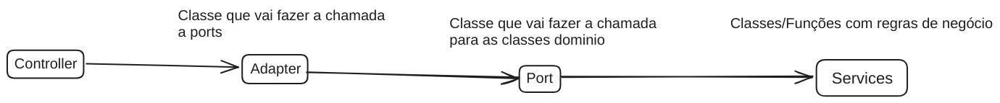

# FastAPI-Hexagonal
Esse projeto faz uso da **Arquitetura Hexagonal** como **Design Pattern**.

Isto é, todo o funcionamento da API se baseia na existência de três estruturas de dados:
- Adapter
- Port
- Service

Toda requisição feita para a API faz uma chamada a um `Adapter`, que faz uso de uma `Port` para se comunicar com o `Service`, que é a parte central da arquitetura.

## Adapter
Um adapter é um ponto de entrada para o usuário. Ele vai interagir com diretamente com uma `Port` para realizar o que precisa ser feito de acordo com seu endpoint.

Um `Adapter` é a interface em que o usuário se comunica com as regras de negócio da aplicação.

## Port
Uma port é um ponto de entrada para um `Service`, que é onde está toda a regra de negócio da aplicação. 

Cada `Port` tem um `Adapter` específico próprio para ele e serve de interface para se chamar uma regra de negócio da aplicação.

## Service
Cada `Service` contém as regras de negócio para uma funcionalidade específica da aplicação. 

A **única** interface de comunicação com um `Service` é uma `Port`. Logo existe um fluxo para se fazer a chamada às regras de negócio, feito de forma à diminuir o acoplamento.